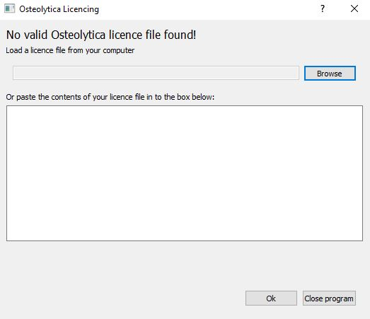

# Installing Osteolytica

## Requirements

### Hardware
* Nvidia GPU

### Software
* Windows 7 or above. Must be 64-bit.
* CUDA 9.1 and current graphics drivers

## Installation

1. CUDA 9.1 must be installed on your system. It can be obtained [here](https://developer.nvidia.com/cuda-91-download-archive)
1. Also make sure that your graphics driver is up-to-date. They can be downloaded at [https://nvidia.com](https://nvidia.com).
1. Run the installation file `Osteolytica.msi` or `setup.exe` to install the program.
1. When starting Osteolytica for the first time, a license window pop-up will appear. Click on "Browse" and select the provided license file or alternatively copy the content of the license file in to the text box.
  
1. Press `Ok` to start the application.
