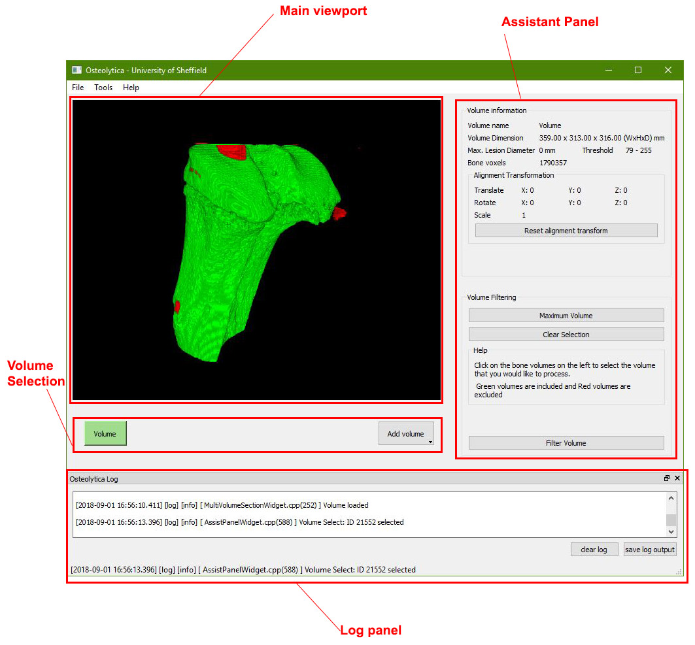
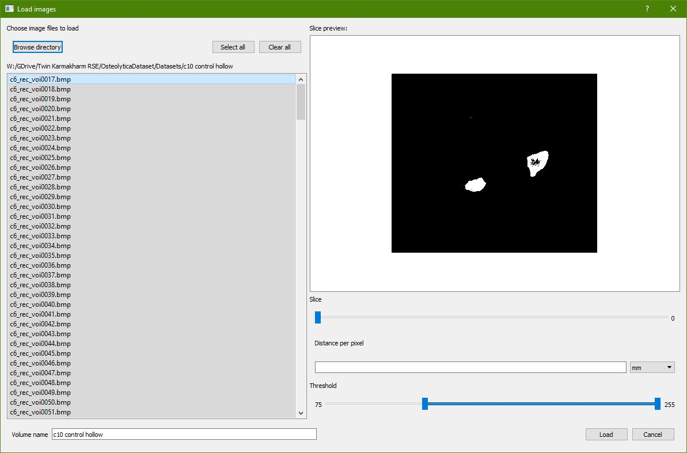
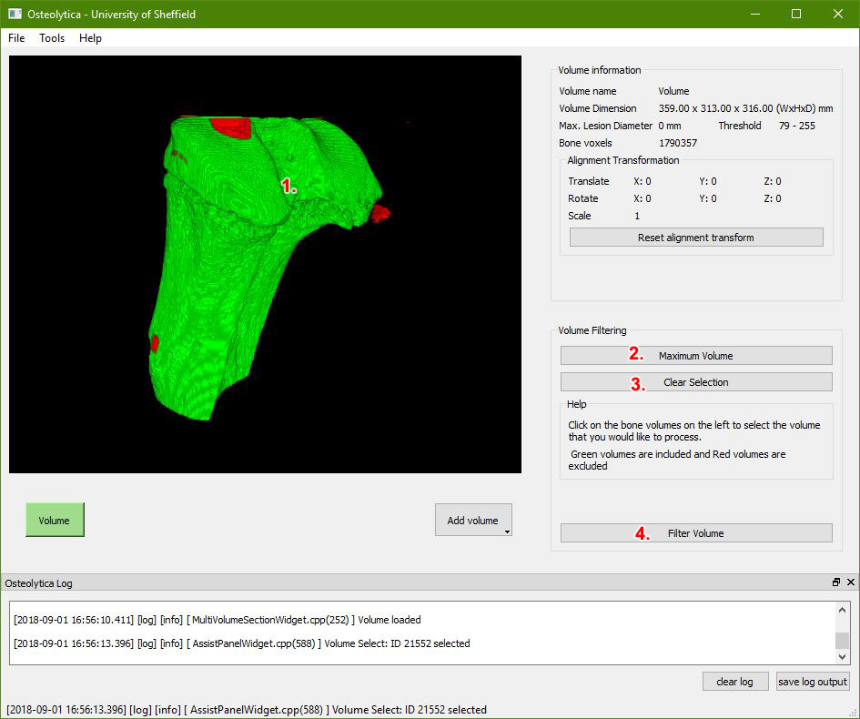
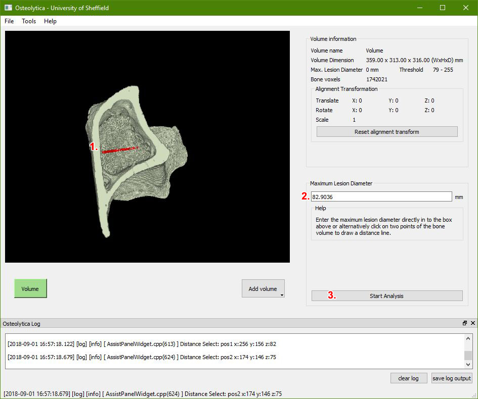
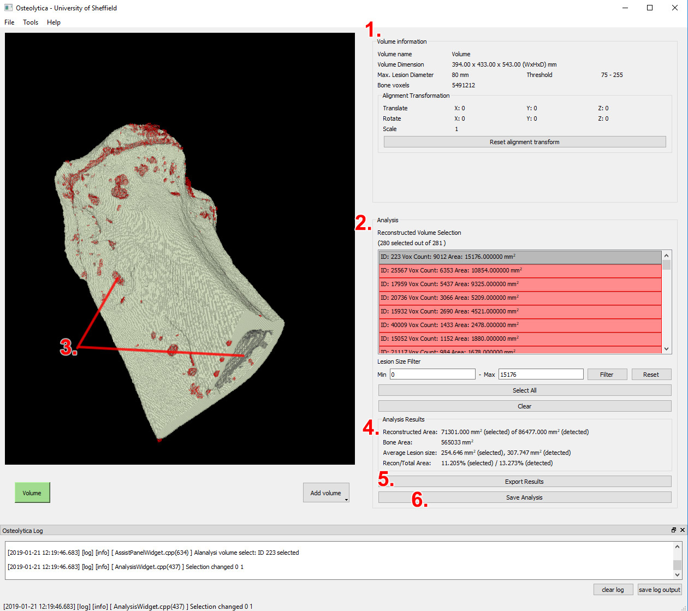
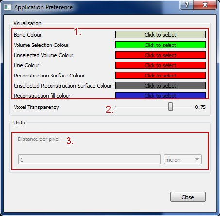

# Osteolytica User Manual

## Basic User Interface

### Main viewport
The main viewport is where the sample is visualised. The mouse can be used to perform zoom and rotation on the sample.

#### To zoom in/out:
Hold middle mouse button + drag up/down

#### To rotate up/down:
Hold right mouse button + drag up/down

#### To rotate left/right:
Hold right mouse button + drag left/right

### Volume Selection Panel
Displays the current loaded volume(s) and provides options to load additional volumes.

### Assistant Panel
Presents options related to the particular stage of the reconstruction. The next and previous button is used to advance or go back to next/previous stage.

**Note:** The assistant panel is a separate window when running on Mac. If accidentally closed, it can be re-opened using the menu “Tools” then “Assistant Panel”

### Log Panel
Display additional information during the processing and analysis of volumes.

## Bone reconstruction, a step-by-step guide
The following is a step-by-step guide for completing a bone reconstruction.

### To begin: Loading a data set

1. Use the menu “File” then “Load images” in order to begin the process of loading a data set.
1. Click on the “Browse directory” button and then select the folder in which the images are stored.
1. All the images in the directory are used by default, use the left panel to filter images to load.
1. Scrub the "Slice" slider to preview through the images that will be loaded.
1. A “Threshold” bounds can be chosen by using the Threshold slider. This is in order to filter out noise in the image. Use this in conjunction with the Frame slider to make sure the noise level is acceptable in all the frames.
1. The distance unit can then be specified. This determines the distance of one pixel in either microns or nanometers.
1. Press “Load” to load the image sequence. The program will then proceed to merge all the image slices and create a volumetric representation of the data set.

### Stage 1: Volume Selection

This stage enables the selection of continuous volumes within the sample data. Unselected volumes are filtered out before the next stage. This helps the software to perform a better reconstruction.

1. Left click anywhere on the bone volume in order to select it. Click it again to de-select.
1. Alternatively click on the “Maximum Volume” button to select the maximum volume.
1. All selections can be cleared using the “Clear Selection” button.
1. Press "Filter Volume" to continue to the next stage.

**Note:** If no volumes are selected (default) then no volumes will be filtered out.

### Stage 2: Maximum Lesion Diameter Selection

During the reconstruction process, the software performs an expansion of existing bone surface in order to create a reconstruction surface. This amount of expansion is determined by the lesion diameter.

1. Click on any two points on the bone volume to draw a line representing the maximum lesion diameter. Rotate the view in order to make sure the line is in the position you expect.
1. Alternatively a value can be manually entered in the Assistant Panel.
1. Click "Start Analysis" to proceed to the next stage and starts the reconstruction and analysis process.

**Note:** If holes still exist in the next stage, it will be necessary to come back to this stage and repeat the process.

### Stage 3: Analysis

This stage shows the result of the reconstructed surface combined with the original bone volume.

1. "Volume Information" area shows the parameters used in order to obtain this reconstruction as well as the volume dimensions.
1. The “Reconstructed Volume Selection” list shows all un-connected lesions. This can be used to include/excluded lesions from the final tally. The results will also show on the bone volume (red is included and grey is excluded by default).
1. The reconstructed regions can also be included/excluded by clicking directly on the bone.
1. The “Analysis Results” displays all statistics about the included reconstruction volumes.
1. The “Export Results” button can be used to export obtained results in a comma separated value format.
1. The "Save Analysis" button can be used to save the analysed volume in raw ".vox" format which can then loaded another time using the menu "File"->"Load Analysis".

### Preference Screen

1. The colours of the bone at every stage can be changed by clicking on the colour box.
1. The density slider is used to set how transparent the visualised bone voxels are.
1. The distance unit scaling can also be viewed on this screen.

## Loading and Saving Volumes

Currently displayed bone volumes can be saved in the native `.vox` file. Use the menu "File"->"Load volume" and "Save volume" to load and save the volumes respectively.

## Exporting Volumetric Data and Visualisation
In addition to exporting the analysis results (see Stage 3), current visualisation and volumetric data can also be exported.

### Exporting Bone Visualisation

Bone visualisation can be exported at any stage after sample has been loaded.

1.	Rotate, pan and/or zoom the main viewport to get the desired view of the sample.
2.	Use the menu “File > Save Visualisation” to save the current bone sample displayed in the main viewport.
3.	Enter a file name
4.	Choose the type of image to be saved (jpg or png) in the “Save as type” box
5.	Press save

### Exporting Bone Volumetric Data

Volumetric data can be exported as a sequence of image slices in jpeg or png format. This can be carried out at any stage after a sample has been loaded.
1.	Use the menu “File > Export Volume”
2.	Enter a file name
3.	Choose the type of image to be saved (jpg or png) in the “Save as type” box
4.	Press save
5.	A directory is created using the file name. The image sequence is located inside the directory.
6.	Empty volume is black, original bone volume is white, reconstruction fill is blue (rgb 0,0,255) and reconstruction surface is coloured red (rgb 255,0,0).

### Exporting Bone Volumetric Data for CTVox

Similar to the last fuction, this export option exports images in grayscale and in the way that allows for easy colour separation of original bone volume and the reconstructed volume in software that uses transfer functions for volumetric rendering.

1.	Use the menu “File > Export Volume for CTVox”
2.	Enter a file name
3.	Choose the type of image to be saved (jpg or png) in the “Save as type” box
4.	Press save
5.	A directory is created using the file name. The image sequence is located inside the directory.
6.	Empty volume is mid grey (rgb 128,128,128), original bone volume is black (rgb 0,0,0) , reconstruction fill is light grey (rgb 200,200,200) and reconstruction surface is white (rgb 255,255,255).
7.	In CTVox, load from the images that has been exported.
8.	In the Transfer function panel of CTVox, choose “Load” and use the provided transfer function file to obtain the correct colouring.
